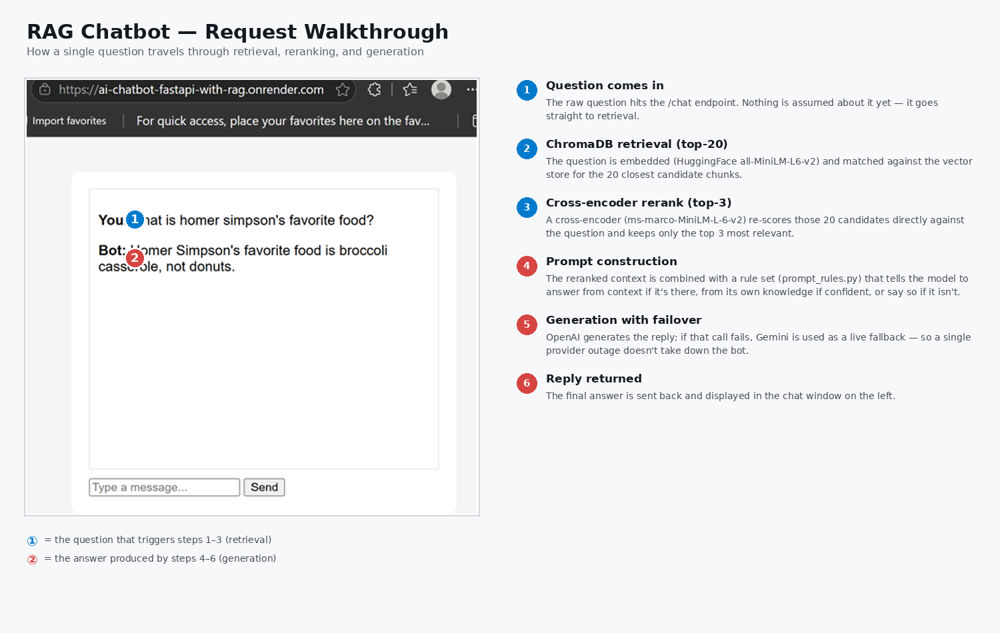
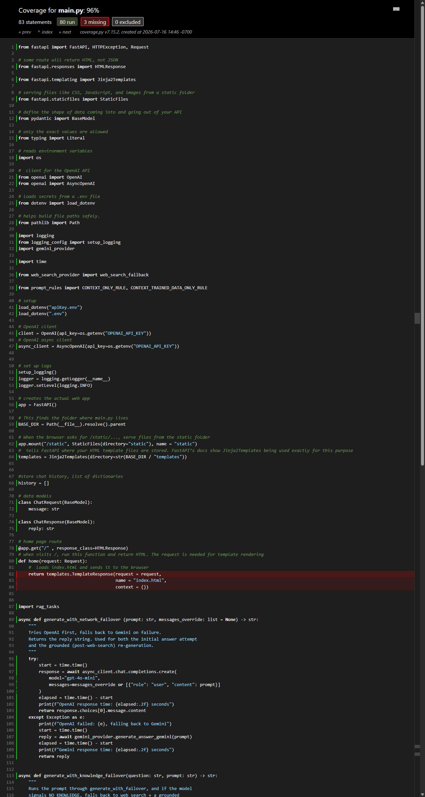

See the [high level architecture](diagram_hierarchy.md) for more.
See the [detail structure](diagram_detail.md) for more.


## Branches
- `main` — current branch. Corrective RAG (CRAG) pipeline:
  - HuggingFace open-source embeddings (`all-MiniLM-L6-v2`), no paid embedding API dependency.
  - Two-stage retrieval: **ChromaDB** search (top-20 candidates), then a HuggingFace cross-encoder (`ms-marco-MiniLM-L-6-v2`) reranks down to the top-3.
  - **Two-tier failover, decoupled from each other:**
    1. *Network failover* (`generate_with_network_failover`): tries OpenAI first, falls back to Gemini on any exception (rate limit, timeout, outage).
    2. *Knowledge failover* (`generate_with_knowledge_failover`): if the model responds with the sentinel `NO_KNOWLEDGE` (meaning local context AND the model's own trained knowledge both came up empty), falls back to a live Tavily web search, then re-generates a grounded answer from those results — routed through the same network-failover call, so a provider outage during the correction step is still covered.
  - Prompt rules extracted into `prompt_rules.py` (`CONTEXT_ONLY_RULE`, `CONTEXT_TRAINED_DATA_ONLY_RULE`) so `main.py` isn't cluttered with long prompt strings, and the rules are independently testable/tunable.
  - Answers sourced from the web-search fallback are labeled in the reply (`"(Note: answer sourced from live web search, not local knowledge base.)"`) so it's clear when the pipeline had to leave the local knowledge base.
  - **Per-session conversation history**: history is scoped by `session_id` (sent by the frontend on every request, stored server-side in `session_store`) rather than a single process-wide list — see "Resolved bugs" below for why this matters.

## Architecture (main)
```
question + session_id
  → look up (or create) session's conversation history
  → embed (HuggingFace all-MiniLM-L6-v2)
  → ChromaDB search (top-20)
  → cross-encoder rerank (top-3)
  → construct_prompt(CONTEXT_TRAINED_DATA_ONLY_RULE, ...)
  → generate_with_knowledge_failover(question, prompt, history)
        → generate_with_network_failover (OpenAI → Gemini on failure)
        → if reply == "NO_KNOWLEDGE":
              → Tavily web search
              → construct_prompt(CONTEXT_ONLY_RULE, ...) on web results
              → generate_with_network_failover again (OpenAI → Gemini on failure)
  → append (question, reply) to this session's history
  → reply
```

## Running it
Three ways to query the pipeline:
1. In Python: `rag_tasks.retrieve("your question")`, then `python main.py`
2. FastAPI's built-in `/docs` endpoint — manually construct a request in the interactive UI
3. curl:
```bash
   curl -X POST http://127.0.0.1:8000/chat \
     -H "Content-Type: application/json" \
     -d '{"message": "your question", "session_id": "test-session"}'
```

### Environment variables required
| Variable | Used by |
|---|---|
| `OPENAI_API_KEY` | `main.py`, primary generation |
| `GEMINI_API_KEY` | `gemini_provider.py`, failover generation |
| `TAVILY_API_KEY` | `web_search_provider.py`, CRAG web-search fallback |
| `INPUT_FILE` | `rag_tasks.py`, source document to chunk/embed at ingest time |

## Resolved bugs

- **Shared global conversation history caused cross-talk between concurrent requests.**
  `history` was originally a module-level list, read at the top of the `/chat` handler
  and appended to at the bottom. Because the handler is `async` and awaits an LLM call
  in between, two concurrent requests could interleave: request B could read the shared
  `history` before request A (which arrived first but is still awaiting its LLM response)
  had appended its turn — resulting in replies rendered against the wrong question,
  or turns appended out of order. Root cause: mutable state shared across an `await`
  boundary, not the use of `async` itself. Fixed by moving `history` into a `session_store`
  dict keyed by a per-browser-tab `session_id` (frontend-generated UUID, sent on every
  request), so each conversation has its own isolated list with nothing to race on.
  Added a regression test asserting that prior turns are correctly threaded into the
  message payload sent to the LLM.

## Timing breakdown (sample run, feature/reranker-huggingface-gemini)
| Stage | Time |
|---|---|
| Chunking | 0.00s |
| HuggingFace embedding | 0.12s |
| FAISS search | 0.00s |
| Cross-encoder rerank | 1.04s |
| Gemini generation | 9.30s |

Retrieval (embedding → FAISS search → rerank) totals ~1.05s; generation dominates total latency at ~9x the retrieval cost. Within retrieval, cross-encoder reranking — not the vector search step — is the bottleneck, since it requires a full forward pass per candidate rather than a precomputed vector lookup.

*(Timing breakdown for the current ChromaDB + CRAG path not yet re-benchmarked — swap the FAISS row for ChromaDB search, and add a row for the Tavily fallback path when the NO_KNOWLEDGE branch fires.)*

## Testing

Full pytest suite under `test/` — **39 tests, 99% statement coverage**, one file per module:
- `test_chunking.py`, `test_retrieval.py`, `test_reranker.py`, `test_embedding.py`, `test_chromadb.py` — core RAG pipeline pieces
- `test_main.py` — `construct_prompt`, `generate_with_network_failover`, `generate_with_knowledge_failover`
- `test_api.py` — `/chat` and `/health` endpoints, including provider-failure and validation error paths
- `test_gemini_provider.py`, `test_web_search_provider.py` — failover and CRAG web-search fallback providers
- `test_utils.py` — shared helpers

Each function is tested for happy path, error path (a real failure — bad input, a dependency throwing), and edge case (valid but boundary input — empty strings, whitespace, etc.) where all three are meaningfully different from each other.

All external calls (OpenAI, Gemini, Tavily, ChromaDB) are mocked — the suite runs with no live API calls and no network dependency.


**Coverage by module:**
| Module | Statements | Missed | Coverage |
|---|---|---|---|
| `embeddings_hf.py` | 6 | 0 | 100% |
| `gemini_provider.py` | 18 | 0 | 100% |
| `logging_config.py` | 10 | 0 | 100% |
| `main.py` | 91 | 4 | 96% |
| `prompt_rules.py` | 2 | 0 | 100% |
| `rag_tasks.py` | 56 | 1 | 98% |
| `reranker_hf.py` | 11 | 0 | 100% |
| `vectorstore_chroma.py` | 9 | 0 | 100% |
| `web_search_provider.py` | 19 | 1 | 95% |
| **Total** | **453** | **6** | **99%** |

## Deployment
Deployed via Docker to both **Render** and **Google Cloud Run**.
https://ai-chatbot-fastapi-3b8w.onrender.com
https://ai-chatbot-with-rag-1016078012439.us-west1.run.app/

Known deployment gotchas worth documenting (all resolved):
- **Cloud Run + memory:** the ML stack (sentence-transformers, cross-encoder, FAISS, ChromaDB) needs real headroom — 512Mi caused a silent out-of-memory kill on container startup with no traceback in the logs. Bumped to 2Gi.
- **Cloud Run + HTTPS scheme:** Cloud Run terminates TLS at its proxy, so the container only ever sees plain `http` internally. FastAPI's `url_for()` generated `http://` links for static assets, which browsers block as mixed content on an otherwise-`https://` page. Fixed by adding `--proxy-headers --forwarded-allow-ips='*'` to the uvicorn CMD, so it trusts Cloud Run's `X-Forwarded-Proto` header instead of guessing.
- **Windows PowerShell + git branch typos:** watch for truncated branch names in push commands (`feature/chromadb` vs `feature/chromadb-migration`).

## Known limitations / planned improvements

- **Context suppresses trained-knowledge fallback.** Even when retrieval returns
  low-relevance chunks, injecting *any* context into the prompt causes the model
  to default to `NO_KNOWLEDGE` and fall back to web search — even for questions
  it could answer confidently from pretraining (e.g. "capital of France").
  Confirmed via controlled test: same question with empty context answers
  correctly from trained knowledge; with irrelevant context injected, it
  defers to web search.
  **Planned fix:** the reranker (`ms-marco-MiniLM-L-6-v2`) already computes a
  relevance score per chunk, but the current pipeline discards it and always
  passes the top-k chunks through. Returning the score and filtering on a
  threshold would let genuinely out-of-scope questions skip context injection
  entirely.

- **No response caching.** Identical questions currently re-run the full
  retrieval → rerank → LLM pipeline every time. Adding an in-memory cache
  (keyed on normalized question text) would avoid redundant calls — with the
  caveat that time-sensitive, web-sourced answers should be excluded from
  caching or given a short TTL.


