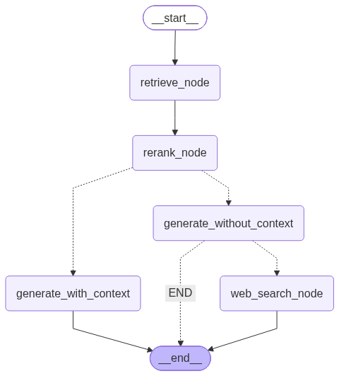
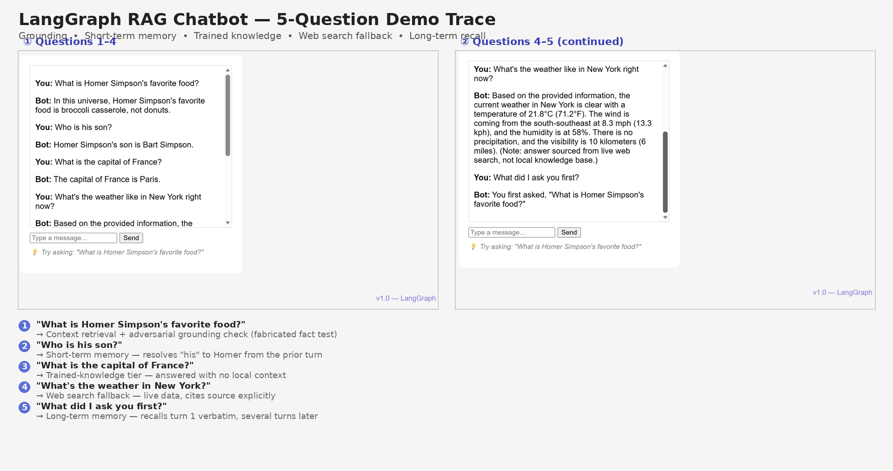
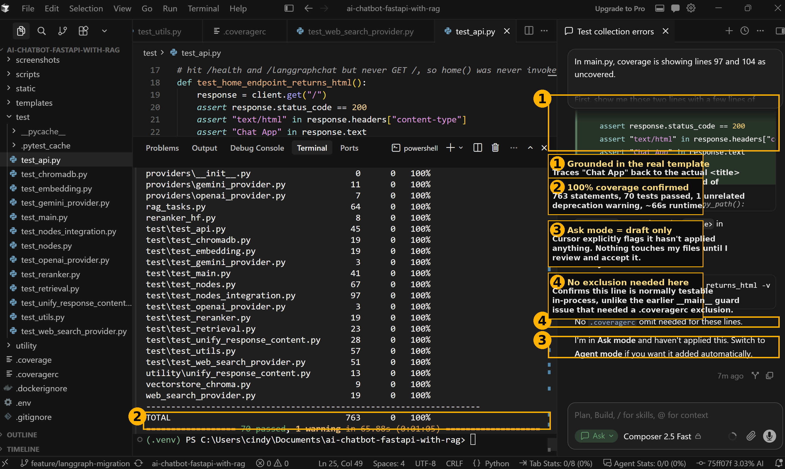

## Architecture Diagram



## Demo Trace



See the [high-level architecture](screenshots/diagram_hierarchy.md) and
[detailed structure](screenshots/diagram_detail.md) for more.

# AI Chatbot with RAG — LangGraph Edition

A retrieval-augmented chatbot built from primitives, then migrated to
[LangGraph](https://github.com/langchain-ai/langgraph) for orchestration,
conversational memory, and conditional routing between retrieval, trained
knowledge, and live web search.

** [Cloud Run deployment] Live demo:** [ai-chatbot-with-rag-1016078012439.us-west1.run.app](https://ai-chatbot-with-rag-1016078012439.us-west1.run.app)

> Looking for the original, from-scratch implementation (no LangChain/LangGraph)?
> See [README_v1_manual_rag.md](README_v1_manual_rag.md) — kept live on Render
> as a before/after comparison.

---

## Architecture

This app implements a three-tier CRAG (Corrective RAG) pipeline as a LangGraph
`StateGraph`:

```
question
   │
   ▼
retrieve_node  (ChromaDB vector search, top-20)
   │
   ▼
rerank_node  (cross-encoder reranker, top-3 + score)
   │
   ├─ score ≥ threshold ──► generate_with_context_node ──► reply
   │
   └─ score < threshold ──► generate_without_context_node
                                  │
                                  ├─ confident answer ──► reply
                                  │
                                  └─ NO_KNOWLEDGE ──► web_search_node ──► reply
```

- **Retrieval:** HuggingFace embeddings (`all-MiniLM-L6-v2`) + ChromaDB vector
  store (`retrieve_node`)
- **Reranking:** Cross-encoder (`ms-marco-MiniLM-L-6-v2`) narrows top-20
  retrieved chunks down to the top 3 most relevant (`rerank_node`) — split
  into its own node so LangSmith traces retrieval and reranking latency
  separately
- **Generation:** Two-tier LLM failover — OpenAI primary, Gemini fallback, via
  LangChain's `with_fallbacks()`
- **Fallback:** Tavily web search when neither local context nor trained
  knowledge can answer the question
- **Memory:** LangGraph's `MemorySaver` checkpointer + `add_messages` reducer
  give the graph multi-turn conversational memory, keyed by `session_id`

## Why LangGraph

The original version (see `README_v1_manual_rag.md`) was built entirely from
primitives — no LangChain — specifically to understand RAG internals deeply
before reaching for a framework. This version migrates orchestration to
LangGraph to get:

- **Explicit state management** — a typed `ChatState` schema instead of
  threading dicts through function calls by hand
- **Conditional routing** — graph edges replace nested if/else fallback logic
- **Built-in conversational memory** — `MemorySaver` + `add_messages` replaced
  a hand-rolled `session_store` dict, removing a redundant/competing source of
  truth for conversation history
- **Provider abstraction** — `ChatOpenAI` / `ChatGoogleGenerativeAI` replaced
  custom message-format converters for OpenAI and Gemini

## Notable debugging story

**Combined retrieve+rerank node obscured the real bottleneck.** LangSmith
traces initially showed one node's total latency without distinguishing
vector search from cross-encoder reranking. Split the original
`retrieve_and_rerank_node` into `retrieve_node` and `rerank_node` so each
step traces separately — confirmed the cross-encoder reranking step, not the
vector search, was the dominant cost, and opened the door to targeted
optimizations (fewer reranked candidates, lower-precision inference, smaller
model variants) without touching retrieval at all.

**Dual history tracking.** Early in the migration, conversation history was
tracked in two places at once: a hand-rolled `session_store` dict, and
LangGraph's `MemorySaver` checkpointer (via the `add_messages` reducer). Both
were being fed into the graph on every turn — a redundancy that risked
silently duplicating messages as conversations grew. Caught this during
architecture review and removed `session_store` entirely, making the
checkpointer the single source of truth for history.

**Cross-provider response shape mismatch.** After migrating to LangChain's
`ChatOpenAI` / `ChatGoogleGenerativeAI` wrappers with `with_fallbacks()`, a
Gemini fallback response rendered as `[object Object]` in the UI. Traced this
to a shape mismatch: OpenAI's `response.content` is always a plain string,
while Gemini's can be a list of content blocks (`[{"type": "text", "text":
"...", "extras": {...}}]`) carrying internal metadata. Wrote a small
normalization utility (`unify_response_content.to_text`) so downstream code
never needs to know which provider actually answered.

**Intermittent `NO_KNOWLEDGE` flip-flopping.** A multi-turn conversation
intermittently lost context on follow-up questions (e.g., "who is his son"
failing to resolve to a prior "Homer Simpson" reference). Systematic
elimination ruled out checkpointer misconfiguration, `thread_id` mismatches,
and prompt-template issues — the root cause turned out to be LLM sampling
variance (`temperature=1` by default) at a borderline decision point in the
knowledge-gate prompt. Confirmed via five repeated runs on identical input
(4/5 answered correctly, 1/5 hedged), then fixed by setting `temperature=0`
on the generation model.

**Closing the last coverage gaps with an AI coding agent.** Used Cursor
(in Ask mode — reviewing every proposed change before applying it, not
auto-accepting agent edits) to help close the final gaps in test coverage.
Two findings worth noting:
- A subprocess-based test for a `__main__` guard passed correctly, but
  coverage still reported the line as missing — `coverage.py` doesn't track
  execution inside child processes by default. Rather than engineer
  subprocess-level coverage tracking for a single print statement, excluded
  that pattern via `.coveragerc`'s `exclude_lines`, which is standard
  practice for `__main__` guards.
- Two FastAPI route handlers (`/` and `/langgraph`) had never been directly
  tested by existing tests. The agent correctly traced the expected test
  assertion back to the actual `<title>` tag in the Jinja template rather
  than guessing placeholder text, and correctly identified that — unlike
  the `__main__` guard — these lines needed no coverage exclusion, since
  they're normally testable in-process.




## Tech stack

FastAPI · Python · LangGraph · LangChain (`langchain-openai`,
`langchain-google-genai`) · ChromaDB · HuggingFace embeddings & cross-encoder
· OpenAI API · Gemini API · Tavily · Docker · Google Cloud Run· Cursor
(AI-assisted development)
## Performance Benchmark: PyTorch vs. ONNX Runtime

Latency comparison for the cross-encoder reranking step in the RAG pipeline.

| Execution Stage | Pre-ONNX (Standard PyTorch) | Post-ONNX Runtime | Speedup / Improvement |
|---|---|---|---|
| Cold Run (First Request) | 0.45s | 0.60s | Initial session overhead |
| Warm Run (Subsequent Requests) | 0.08s – 0.36s (avg ~0.22s) | 0.07s – 0.08s (avg ~0.075s) | Up to 3x–4x faster |
| Execution Jitter | High variance | Low variance / flattened | Highly consistent latency |

## Debugging a Latency Regression: Stale Chunk Data

After deploying the ONNX-optimized reranker, a LangSmith trace flagged a `rerank_node` call at 5.68s — far outside the benchmarked range above. Instrumenting the reranking function stage-by-stage (tokenization, model forward pass, scoring) isolated the cost to the model forward pass itself, not cold start.

**Root cause:** ChromaDB contained stale chunks left over from before the current chunking config (500 chars / 50 overlap) was set, because prior ingestion runs reused sequential IDs without clearing the collection. Two outlier chunks (3,136 and 3,277 characters — roughly 6–7x the intended chunk size) were inflating the tokenized batch to the full 512-token ceiling on every rerank call that retrieved them.

| Stage | Forward Pass Time | Input Shape | Notes |
|---|---|---|---|
| Before fix | 1.072s | [10, 512] (truncated) | Oversized stale chunks inflating batch |
| Interim: `max_length=256` cap | 0.457s | [10, 256] (truncated) | Masked the symptom — silently dropped content |
| After: ChromaDB cleared/re-ingested | 0.205s | [10, 113] (natural) | Root cause fixed, no truncation needed |

**Fix:** Cleared and re-ingested the ChromaDB collection to remove the stale chunks. Also replaced the interim `max_length=256` guess with `calculate_max_length()` — a startup helper that derives `max_length` from the tokenizer's actual chars-per-token ratio against the real `chunk_size`/`chunk_overlap` config, so the value stays correct automatically if chunking config ever changes, instead of relying on a hardcoded guess.

## Production Verification

After the fix, three consecutive live requests (real queries, real ChromaDB retrieval, real reranking) confirmed the fix holds under normal traffic, not just in isolated testing:

| Request | Input Shape | Forward Pass | Full Rerank Step | LangGraph Total |
|---|---|---|---|---|
| 1 | [10, 113] | 0.196s | 0.20s | 1.29s |
| 2 | [10, 94] | 0.155s | 0.16s | 1.12s |
| 3 | [10, 109] | 0.180s | 0.18s | 1.10s |

`MAX_LENGTH` was derived automatically at startup as `165` (from `chunk_size=500`, `chunk_overlap=50`), and all three requests stayed comfortably under that ceiling with no truncation — reranking now accounts for a small, consistent fraction of total pipeline latency, with the OpenAI generation call as the dominant remaining cost.

## Testing
This project uses LangSmith to trace every graph run. Each turn's
inputs/outputs and message history are inspected via the Turns view,
making it easy to debug multi-step agent behavior.
![LangSmith Observability]screenshots/annotated_langsmith.jpg)


Pytest suite with mocked provider calls, graph node unit tests, and
integration tests exercising the compiled graph end-to-end — **100% line
coverage across the codebase** (792 statements, 72 tests). Run with:

```bash
pytest --cov
```

## Evaluation

Beyond tracing, this project uses [LangSmith's evaluation framework](https://docs.smith.langchain.com/evaluation)
to score the compiled graph against curated datasets rather than relying on
manual spot-checks.

- **`correctness_evaluator`** — LLM-as-judge, scores whether the generated
  answer matches a reference answer semantically (not exact string match),
  run against both single-turn and multi-turn datasets
- **`turn_attribution_evaluator`** — multi-turn only; checks the model
  answered the *current* question rather than drifting back to an earlier
  one in the conversation, directly regression-testing the flattened-message
  bug fix described above
- **`retrieval_relevance_evaluator`** — grades the retrieved/reranked chunks
  themselves against the question, independent of the final answer

Separating retrieval-quality from generation-quality scoring matters because
they can diverge in informative ways: relevant chunks with a wrong answer
point at a generation/prompting bug, while a correct answer built on
irrelevant chunks means the model got lucky from its own trained knowledge
rather than actually grounding in retrieved context — the two failure modes
need different fixes.

```bash
python evaluation/eval_single_turn.py
python evaluation/eval_multi_turn.py
python evaluation/eval_retrieval.py
```

**Known limitation:** dataset size is currently small (~13 single-turn, ~9
multi-turn examples) and there's no dedicated groundedness/faithfulness
evaluator yet — the next addition would check that generated answers are
actually supported by the retrieved context, not just correct by coincidence.

## Running locally

```bash
pip install -r requirements.txt
uvicorn main:app --reload
```

Requires `OPENAI_API_KEY`, `GEMINI_API_KEY`, `TAVILY_API_KEY`, and
`LANGSMITH_API_KEY` set as environment variables (or in an `.env` /
`apiKey.env` file).

## Repo structure

```
main.py                 # FastAPI app, /langgraphchat endpoint
graph_builder.py         # LangGraph StateGraph, nodes, conditional edges
providers/                # OpenAI / Gemini LLM wrappers
utility/                   # Cross-provider response normalization
scripts/                   # Standalone debugging/calibration scripts
test/                      # Pytest suite
```
