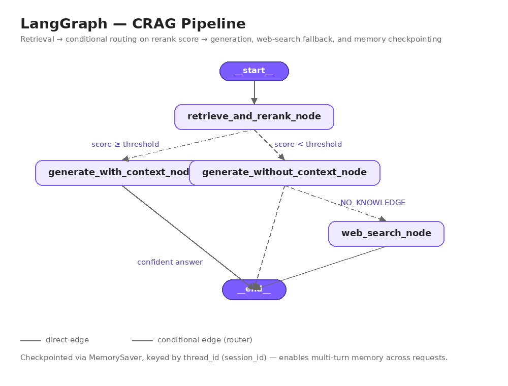

## Architecture Diagram



## Demo Trace


See the [high-level architecture](screenshots/diagram_hierarchy.md) and
[detailed structure](screenshots/diagram_detail.md) for more.

# AI Chatbot with RAG — LangGraph Edition

A retrieval-augmented chatbot built from primitives, then migrated to
[LangGraph](https://github.com/langchain-ai/langgraph) for orchestration,
conversational memory, and conditional routing between retrieval, trained
knowledge, and live web search.

**: [Cloud Run deployment] Live demo:** [ai-chatbot-with-rag-1016078012439.us-west1.run.app](https://ai-chatbot-with-rag-1016078012439.us-west1.run.app)

> Looking for the original, from-scratch implementation (no LangChain/LangGraph)?
> See [README_v1_manual_rag.md](README_v1_manual_rag.md) — kept live on Render
> as a before/after comparison.

---

## Architecture

This app implements a three-tier CRAG (Corrective RAG) pipeline as a LangGraph
`StateGraph`:

```
question
   │
   ▼
retrieve_and_rerank_node  (ChromaDB + cross-encoder reranker)
   │
   ├─ score ≥ threshold ──► generate_with_context_node ──► reply
   │
   └─ score < threshold ──► generate_without_context_node
                                  │
                                  ├─ confident answer ──► reply
                                  │
                                  └─ NO_KNOWLEDGE ──► web_search_node ──► reply
```

- **Retrieval:** HuggingFace embeddings (`all-MiniLM-L6-v2`) + ChromaDB vector store
- **Reranking:** Cross-encoder (`ms-marco-MiniLM-L-6-v2`) narrows top-20 retrieved
  chunks down to the top 3 most relevant
- **Generation:** Two-tier LLM failover — OpenAI primary, Gemini fallback, via
  LangChain's `with_fallbacks()`
- **Fallback:** Tavily web search when neither local context nor trained
  knowledge can answer the question
- **Memory:** LangGraph's `MemorySaver` checkpointer + `add_messages` reducer
  give the graph multi-turn conversational memory, keyed by `session_id`

## Why LangGraph

The original version (see `README_v1_manual_rag.md`) was built entirely from
primitives — no LangChain — specifically to understand RAG internals deeply
before reaching for a framework. This version migrates orchestration to
LangGraph to get:

- **Explicit state management** — a typed `ChatState` schema instead of
  threading dicts through function calls by hand
- **Conditional routing** — graph edges replace nested if/else fallback logic
- **Built-in conversational memory** — `MemorySaver` + `add_messages` replaced
  a hand-rolled `session_store` dict, removing a redundant/competing source of
  truth for conversation history
- **Provider abstraction** — `ChatOpenAI` / `ChatGoogleGenerativeAI` replaced
  custom message-format converters for OpenAI and Gemini

## Notable debugging story
**Dual history tracking.** Early in the migration, conversation history was
tracked in two places at once: a hand-rolled `session_store` dict, and
LangGraph's `MemorySaver` checkpointer (via the `add_messages` reducer). Both
were being fed into the graph on every turn — a redundancy that risked
silently duplicating messages as conversations grew. Caught this during
architecture review and removed `session_store` entirely, making the
checkpointer the single source of truth for history.

**Cross-provider response shape mismatch.** After migrating to LangChain's
`ChatOpenAI` / `ChatGoogleGenerativeAI` wrappers with `with_fallbacks()`, a
Gemini fallback response rendered as `[object Object]` in the UI. Traced this
to a shape mismatch: OpenAI's `response.content` is always a plain string,
while Gemini's can be a list of content blocks (`[{"type": "text", "text":
"...", "extras": {...}}]`) carrying internal metadata. Wrote a small
normalization utility (`unify_response_content.to_text`) so downstream code
never needs to know which provider actually answered.

**Intermittent `NO_KNOWLEDGE` flip-flopping.** A multi-turn conversation
intermittently lost context on follow-up questions (e.g., "who is his son"
failing to resolve to a prior "Homer Simpson" reference). Systematic
elimination ruled out checkpointer misconfiguration, `thread_id` mismatches,
and prompt-template issues — the root cause turned out to be LLM sampling
variance (`temperature=1` by default) at a borderline decision point in the
knowledge-gate prompt. Confirmed via five repeated runs on identical input
(4/5 answered correctly, 1/5 hedged), then fixed by setting `temperature=0`
on the generation model.

## Tech stack

FastAPI · Python · LangGraph · LangChain (`langchain-openai`,
`langchain-google-genai`) · ChromaDB · HuggingFace embeddings & cross-encoder
· OpenAI API · Gemini API · Tavily · Docker · Google Cloud Run

## Testing

Pytest suite with mocked provider calls, graph node unit tests, and
integration tests exercising the compiled graph end-to-end — 98% line
coverage across the codebase. Run with:

```bash
pytest --cov
```


## Running locally

```bash
pip install -r requirements.txt
uvicorn main:app --reload
```

Requires `OPENAI_API_KEY` and `GEMINI_API_KEY` set as environment variables
(or in an `.env` / `apiKey.env` file).

## Repo structure

```
main.py                 # FastAPI app, /langgraphchat endpoint
graph_builder.py         # LangGraph StateGraph, nodes, conditional edges
providers/                # OpenAI / Gemini LLM wrappers
utility/                   # Cross-provider response normalization
scripts/                   # Standalone debugging/calibration scripts
test/                      # Pytest suite
```
