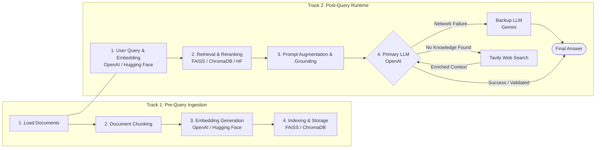

```mermaid
flowchart LR
    %% --- LEFT SIDE: PRE-QUERY INGESTION ---
    subgraph Track1 [Track 1: Pre-Query Ingestion]
        direction TD
        Load[1. Load Documents]
        --> Chunk[2. Document Chunking]
        --> EmbedIngest[3. Embedding Generation<br/>OpenAI / Hugging Face]
        --> Index[4. Indexing & Storage<br/>FAISS / ChromaDB]
    end

    %% Hard horizontal alignment tie to lock the top row
    Load --- QueryInput

    %% --- RIGHT SIDE: POST-QUERY RUNTIME ---
    subgraph Track2 [Track 2: Post-Query Runtime]
        direction TD
        QueryInput[1. User Query & Embedding<br/>OpenAI / Hugging Face]
        --> Retrieve[2. Retrieval & Reranking<br/>FAISS / ChromaDB / HF]
        --> Augment[3. Prompt Augmentation & Grounding]
        
        %% Step 4: The Core Generation Hub
        --> LLM1{4. Primary LLM<br/>OpenAI}

        %% Left Branch: Network Failover (Goes straight to Output)
        LLM1 -->|Network Failure| LLM2[Backup LLM<br/>Gemini]
        LLM2 --> Output

        %% Right Branch: Knowledge Fallback Loop (Feeds back to Primary)
        LLM1 -->|No Knowledge Found| Tavily[Tavily Web Search]
        Tavily -->|Enriched Context| LLM1
        
        %% Success Path Straight Down
        LLM1 -->|Success / Validated| Output([Final Answer])
    end
```
