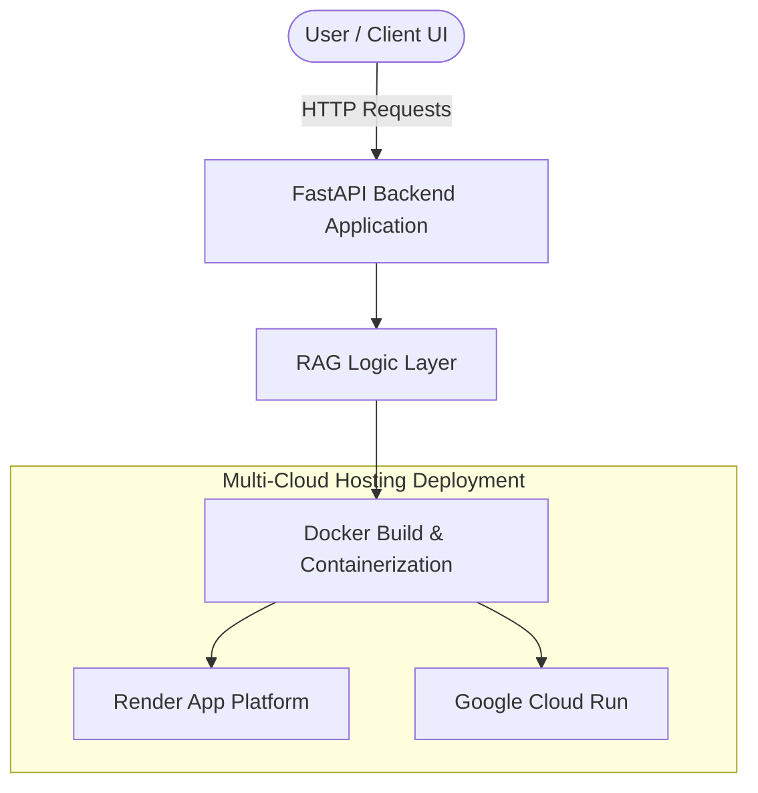

```mermaid
graph TD
    Client([User / Client UI]) 
    -->|HTTP Requests| FastAPI[FastAPI Backend Application]
    --> RAG[RAG Logic Layer]
    --> Docker[Docker Build & Containerization]

    subgraph Infrastructure [Multi-Cloud Hosting Deployment]
        Docker --> Render[Render App Platform]
        Docker --> GCR[Google Cloud Run]
    end
```
